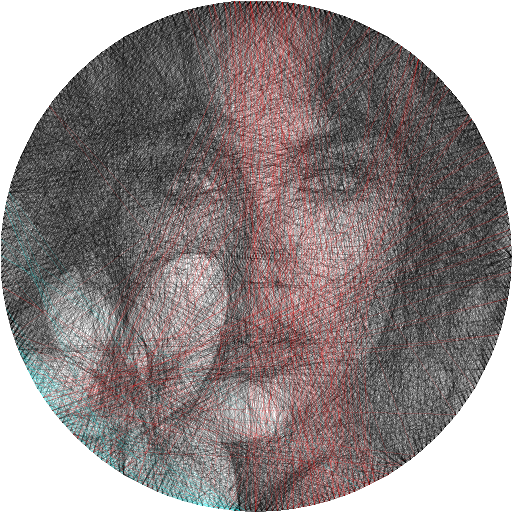
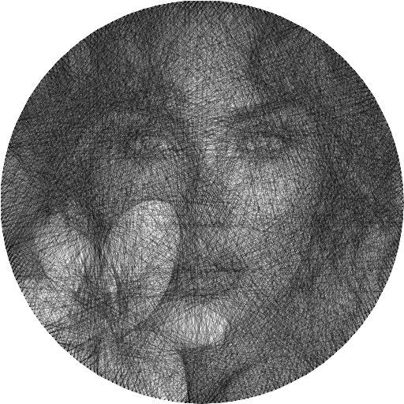

# StringArt: Image to Thread Art Generator

**Author:** [vxjnc](https://github.com/vxjnc)
**License:** [MIT License](LICENSE)

**StringArt** is a high-performance command-line tool written in C++ that transforms standard raster images into stunning representations of thread art (string art) by calculating the optimal sequence of threads (lines) between fixed points (pegs).

## ⚙️ Building the Project
### Prerequisites (Debian/Ubuntu)

Ensure you have a C++ compiler and the `CMake` utility installed:

```bash
sudo apt update
sudo apt install build-essential cmake
```

### Compilation

Navigate to the project's root directory and simply run:

```bash
cmake -S . -B build -DCMAKE_BUILD_TYPE=Release && cmake --build build -- -j$(nproc)
```

This command compiles the source files and generates the main executable file named `StringArt`.

## 🚀 Usage

The generated executable StringArt processes images based on command-line arguments, specifying input, output, and processing parameters.

Command-Line Options

You can view the full list of options by running the program with the -h or --help flag:

```
./StringArt -h
Usage: StringArt.exe [--help] [--version] [--input-image VAR] [--output-image VAR] [--input-sequence VAR] [--output-sequence VAR] [--nails VAR] [--max-iterations VAR] [--k-density VAR] [--alpha VAR] [--load-sequence] [--sobel] [--colors VAR]

Optional arguments:
  -h, --help              shows help message and exits 
  -v, --version           prints version information and exits 
  -ii, --input-image      Input image path. [nargs=0..1] [default: "input.png"]
  -oi, --output-image     Output image path. [nargs=0..1] [default: "output.png"]
  -is, --input-sequence   Input sequence file. [nargs=0..1] [default: "sequence.txt"]
  -os, --output-sequence  Output sequence file. [nargs=0..1] [default: "sequence.txt"]
  -n, --nails             Number of nails. [nargs=0..1] [default: 300]
  -it, --max-iterations   Maximum iterations. [nargs=0..1] [default: 4500]
  -kd, --k-density        Density parameter. [nargs=0..1] [default: 500]
  -a, --alpha             Alpha blending value. [nargs=0..1] [default: 0.15]
  -ls, --load-sequence    Load existing sequence instead of generating a new one. 
  -s, --sobel             Apply Sobel filter to the input image before processing. 
  -c, --colors            Custom colors in RGB format. [nargs=0..1] [default: "0:0:0;255:255:255;255:0:0;0:255:0;0:0:255;255:0:255;0:255:255;255:255:0"]
```

### Basic Execution

To run the program, use the following syntax. The program will typically look for a configuration file or use default settings if no specific parameters are provided.

### Command Examples

Here are examples demonstrating how to generate different styles of String Art from a source image.

| Input Image | Output Image | Command Executed |
| :---: | :---: | :---: |
|  |  | `./StringArt -ii assets/input.png -oi assets/output.png` |
|  |  | `./StringArt -ii assets/input.png -oi assets/output-gray.png -os sequence-gray.txt -c "0:0:0"` |


## 📂 Project Structure

```
.
├── assets/                  # Example input/output images for documentation
├── build/                   # Compiled object files (ignored by Git)
├── include/                 # Third-party headers (stb)
├── src/                     # C++ Source files
├── .gitignore               # List of files to ignore
├── LICENSE                  # MIT License details
├── main.cpp                 # Main program entry point
└── Makefile                 # Build instructions
```

## ✨ Contributing

Feel free to open issues or submit pull requests if you find bugs or want to implement new features.
